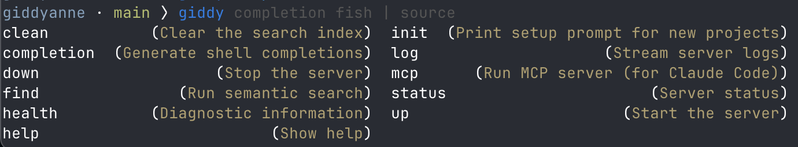
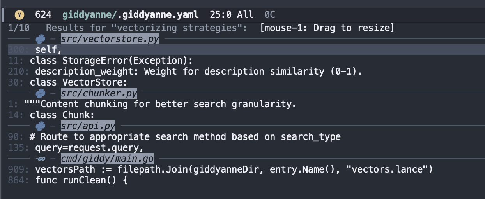
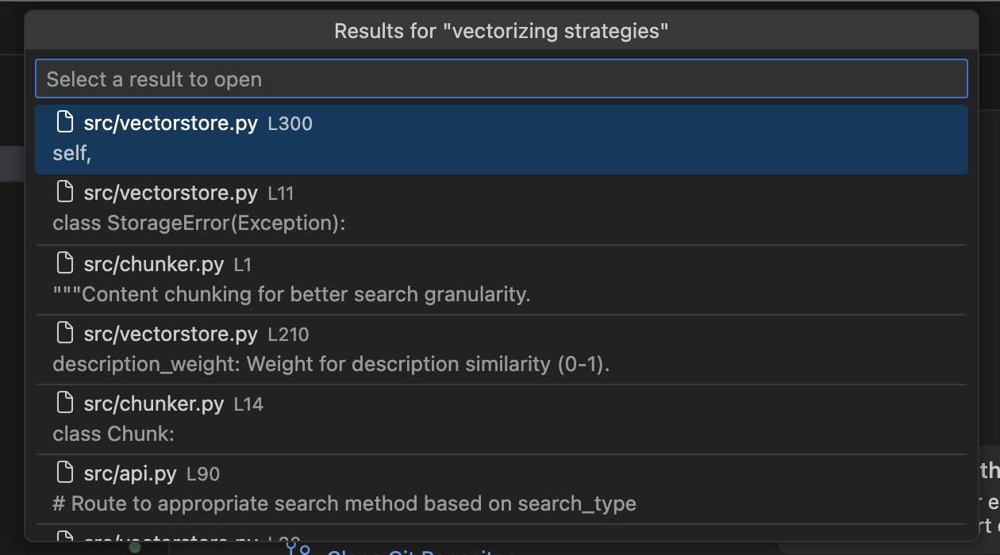

# *CODE RAG:* Giddyanne

Semantic codebase search. Indexes your files with embeddings and lets you find code by meaning, not just keywords.

**Current version: 1.1.1** · [Changelog](CHANGELOG.md) · [User Guide](GUIDE.md)

- **Semantic search**: Find code by meaning ("auth logic" finds `login.py`)
- **Real-time indexing**: Watches for file changes and re-indexes automatically
- **Project config**: Define paths + descriptions in `.giddyanne.yaml`
- **Local-first**: Runs sentence-transformers locally, no API keys needed
- **Private**: Keeps your code on your machine
- **Fast**: Pre-indexed embeddings, search in milliseconds

## Project Summary

### Quick Start

```bash
# After install and setup...

giddyanne · main ⟩ giddy up
> Starting server...
> Server started on port 8000

giddyanne · main ⟩ giddy health
> Indexed files: 28
> Total chunks:  288
> Index size:    3.85 MB
> Startup time:  10504 ms
> Avg latency:   (no queries yet)

giddyanne · main ⟩ giddy find --verbose --limit 1 formatting functions
> 
> cmd/giddy/main.go:889-906 (0.31)
>   func formatBytes(bytes int64) string {
>         const (
>                 KB = 1024
>                 MB = KB * 1024
>                 GB = MB * 1024
>         )
>         switch {
>         case bytes >= GB:
>                 return fmt.Sprintf("%.2f GB", float64(bytes)/GB)
>         case bytes >= MB:
>                 return fmt.Sprintf("%.2f MB", float64(bytes)/MB)
>         case bytes >= KB:
>                 return fmt.Sprintf("%.2f KB", float64(bytes)/KB)
>         default:
>                 return fmt.Sprintf("%d bytes", bytes)
>         }
>   }

giddyanne · main ⟩ giddy down
> Server stopped

giddyanne · main ⟩ giddy status
> Not running
```

### Supported Languages

Only files with supported extensions are indexed. Code is split at natural boundaries (functions, classes, etc.) for better search results.

**Programming languages:** C, C++, C#, Dart, Elixir, Go, Java, JavaScript, Kotlin, Lua, Objective-C, PHP, Python, R, Ruby, Rust, Scala, Shell, SQL, Swift, TypeScript, Zig

**Markup & config:** CSS, HTML, JSON, Markdown, TOML, YAML

Files matching `.gitignore` patterns are automatically excluded.

## Installation

**Platforms:** macOS, Linux

Requires Python 3.11+ and Go 1.21+

> **Heads up:** First install downloads ~2GB (PyTorch + dependencies). First search downloads the embedding model (~90MB). These are one-time downloads.

> **Indexing time:** ~750 files takes ~45 seconds on M1 Pro. Runs once at startup, then watches for changes.

```bash
git clone --depth 1 --branch v1.1.1 https://github.com/mazziv/giddyanne.git
cd giddyanne
make install
```

This builds the CLI, creates a Python virtualenv, and symlinks `giddy` to `~/bin`. To install elsewhere:

```bash
make install BIN_DIR=/usr/local/bin  # or any directory in your PATH
```

### Pre-built Binary

If you don't have Go installed, see [INSTALL.md](INSTALL.md) for instructions on using pre-built binaries from [Releases](https://github.com/mazziv/giddyanne/releases).

## Project Config

A `.giddyanne.yaml` file is required in your project root.

Minimal config:

```yaml
paths:
  - path: .
    description: My app
```

Example of a minimally annotated config:

```yaml
paths:
  - path: src/
    description: Core application source code

  - path: src/auth/
    description: Authentication, login, sessions, permissions

  - path: tests/
    description: Test suite and fixtures
```

That's it! Only supported language files are indexed, and `.gitignore` is respected automatically.

Descriptions are embedded alongside content for better semantic matching. See [GUIDE.md](GUIDE.md#settings-reference) for all available settings.

Tip: Run `giddy init` to generate a prompt you can paste into Claude or another LLM - it will analyze your codebase and create the config for you.

> claude "follow the instructions: ${giddy init}"

## CLI Reference

Run `giddy help`

| Command | Description |
|---------|-------------|
| `giddy find <query>` | Search the codebase (auto-starts server if needed) |
| `giddy up` | Start the server |
| `giddy down` | Stop the server |
| `giddy bounce` | Restart the server |
| `giddy status` | Show server status and indexing progress |
| `giddy health` | Show index statistics (files, chunks, size) |
| `giddy log` | Stream server logs in real-time |
| `giddy drop` | Remove search index (keeps logs) |
| `giddy clean` | Remove all .giddyanne data (with confirmation) |
| `giddy init` | Generate a config file prompt |
| `giddy mcp` | Run MCP server (for Claude Code) |

Commands can be abbreviated: `giddy f` for `find`, `giddy st` for `status`, etc.

**Flags:**
```bash
giddy up --port 9000      # Use specific port
giddy up --host localhost # Bind to specific host
giddy up --verbose        # Enable debug logging
giddy find --limit 20     # Return more results
giddy find --json         # Output as JSON
giddy find --files-only   # Only show file paths
giddy find --verbose      # Show full content (no truncation)
giddy find --semantic     # Results from semantic search only
giddy find --full-text    # Results from full-text search only
giddy health --verbose    # List all files with chunk counts
```

## Shell Completions

Enable tab completion for commands and flags:

**Bash** (add to `~/.bashrc`):
```bash
eval "$(giddy completion bash)"
```

**Zsh** (add to `~/.zshrc`):
```zsh
eval "$(giddy completion zsh)"
```

**Fish** (add to `~/.config/fish/config.fish`):
```fish
giddy completion fish | source
```



## Integrations

### MCP Server (Claude Code)

Add to your project's `.mcp.json` (or global `~/.claude/config.json`):

```json
{
  "mcpServers": {
    "giddyanne": {
      "command": "giddy",
      "args": ["mcp"]
    }
  }
}
```

The `giddy mcp` command finds the project root by walking up to `.giddyanne.yaml`.

### Emacs

Requires Emacs 28.1+. Add to your init file:

```elisp
(add-to-list 'load-path "/path/to/giddyanne/emacs")  ; adjust to your clone location
(require 'giddyanne)

;; Optional keybindings
(global-set-key (kbd "C-c g f") #'giddyanne-find)
(global-set-key (kbd "C-c g u") #'giddyanne-up)
(global-set-key (kbd "C-c g d") #'giddyanne-down)
(global-set-key (kbd "C-c g s") #'giddyanne-status)
```

Or with `use-package`:

```elisp
(use-package giddyanne
  :load-path "/path/to/giddyanne/emacs"
  :bind (("C-c g f" . giddyanne-find)
         ("C-c g u" . giddyanne-up)
         ("C-c g d" . giddyanne-down)
         ("C-c g s" . giddyanne-status)))
```

<details>
<summary>Doom Emacs config</summary>

```elisp
(use-package giddyanne
  :load-path "/path/to/giddyanne/emacs"
  :commands (giddyanne-find giddyanne-up giddyanne-down giddyanne-status giddyanne-log giddyanne-health)
  :init
  (map! :leader
        (:prefix "s"
         :desc "giddyanne" "g" #'giddyanne-find)
        (:prefix "g"
         (:prefix ("a" . "giddyanne")
          :desc "up" "u" #'giddyanne-up
          :desc "down" "d" #'giddyanne-down
          :desc "find" "f" #'giddyanne-find
          :desc "log" "l" #'giddyanne-log
          :desc "status" "s" #'giddyanne-status
          :desc "health" "h" #'giddyanne-health))))
```

</details>

**Commands:**
| Command | Description |
|---------|-------------|
| `giddyanne-find` | Semantic search with completion |
| `giddyanne-up` | Start server |
| `giddyanne-down` | Stop server |
| `giddyanne-status` | Show server status |
| `giddyanne-health` | Show index stats |
| `giddyanne-log` | Toggle log buffer |

The package integrates with Vertico (showing results grouped by file) and nerd-icons (file type icons in results).



### VSCode

Requires Node.js 18+ and npm.

```bash
cd giddyanne
make vscode
code --install-extension vscode/giddyanne-1.1.1.vsix
```

**Commands:**
| Command | Keybinding | Description |
|---------|------------|-------------|
| `Giddyanne: Find` | `Cmd+Shift+G` | Semantic search with QuickPick |
| `Giddyanne: Start Server` | | Start server |
| `Giddyanne: Stop Server` | | Stop server |
| `Giddyanne: Server Status` | | Show server status |
| `Giddyanne: Index Health` | | Show index stats |
| `Giddyanne: Stream Logs` | | Open terminal with live logs |



### HTTP API

The CLI manages the HTTP server for you, but you can also use the API directly:

```bash
# Search files
curl -X POST http://localhost:8000/search \
  -H "Content-Type: application/json" \
  -d '{"query": "database connection", "limit": 5}'

# Get stats
curl http://localhost:8000/stats

# Check indexing progress
curl http://localhost:8000/status

# Health check
curl http://localhost:8000/health
```

## Help Wanted

Contributions welcome! Here's what would help most:

**Windows support** - The Python server should work, but needs testing and documentation:
- Test installation and server on Windows
- Document any needed changes (paths, process management)
- Update Makefile or add Windows-specific install script

**Vim/Neovim plugin** - A plugin that calls the CLI and populates quickfix:
- `giddy find` integration with fzf or telescope
- Results to quickfix list
- Basic commands: up, down, status

Open an issue to discuss or submit a PR.

## Development

```bash
# Install dev dependencies
.venv/bin/pip install -e ".[dev]"

# Run linter
.venv/bin/ruff check .

# Run tests
.venv/bin/pytest
```

## License

MIT
